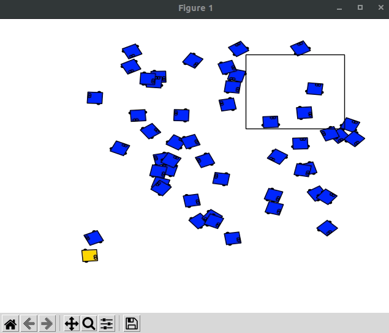
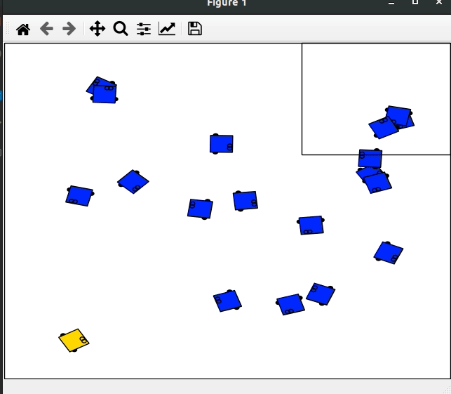
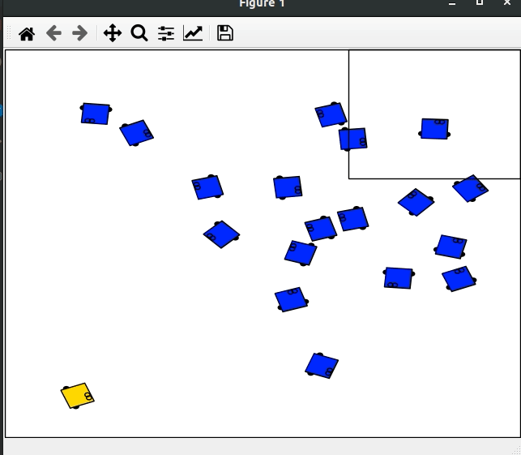
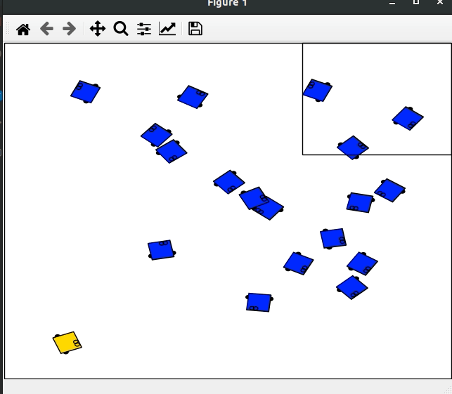

# CLF_CBF_NMPC_python

An unofficial python implement of nonlinear model predictive control with control Lyapunov functions and control barrier functions (CLF-CBF-NMPC).
(Details are in [https://arxiv.org/abs/2105.10596](https://arxiv.org/abs/2105.10596))  

## Simulation Environment
The test code `test.py` is based on the simulation environment [Robotarium (https://github.com/robotarium/robotarium_python_simulator)](https://github.com/robotarium/robotarium_python_simulator).
Directory `\rps` contains a modified *Robotarium* environment specifically tuned for a reach-avoid task in a crowded environment.  

## Demonstration

-   The yellow dubin car's objective is to reach a goal area (the rectangle) while avoiding all other blue agents running in the scene.  
-   This CLF-CBF-NMPC module provides a motion planning solution. 

